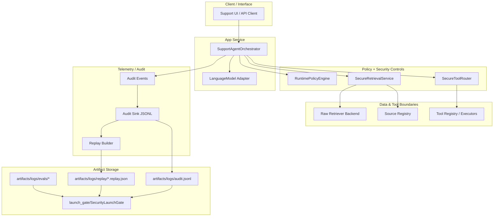

# Deployment Architecture (Practical Starter-Kit View)

This document describes a practical deployment shape for the current starter kit implementation.
It stays aligned to repository components and does **not** assume provider-specific infrastructure.

## 1) Deployment Layers

### Client / Interface Layer
- External clients (web app, support console, API client) submit requests with `request_id`, actor, and tenant context.
- This layer is untrusted input by default.

### API / App Service Layer
- Hosts `SupportAgentOrchestrator` (`app/orchestrator.py`) as the policy-aware request entrypoint.
- Enforces stage sequencing: retrieval policy -> retrieval -> generation policy -> model -> tool-routing policy -> tool decisions.

### Retrieval Boundary Layer
- `SecureRetrievalService` (`retrieval/service.py`) fronts retrieval backends.
- Applies tenant/source boundary checks, trust-domain restrictions, and trust/provenance validation before docs are accepted.

### Policy Engine Layer
- `RuntimePolicyEngine` (`policies/engine.py`) evaluates action-specific policy decisions for:
  - `retrieval.search`
  - `model.generate`
  - `tools.route`
  - `tools.invoke`
- Policy artifacts are loaded from `policies/bundles/default/policy.json` (or environment-specific equivalents).

### Tool Router Layer
- `SecureToolRouter` (`tools/router.py`) mediates all tool invocation decisions.
- Enforces registration/allowlist/forbidden field/confirmation/rate-limit checks and policy-driven `tools.invoke` authorization.

### Telemetry / Audit Layer
- Orchestrator emits structured audit events (`telemetry/audit/contracts.py`).
- Sinks include in-memory and JSONL (`telemetry/audit/sinks.py`).
- Replay artifacts are generated from event streams (`telemetry/audit/replay.py`).

### Artifact Storage Layer
- Runtime and evaluation evidence are file-based in this starter kit:
  - `artifacts/logs/audit.jsonl`
  - `artifacts/logs/replay/*.replay.json`
  - `artifacts/logs/evals/*.jsonl`
  - `artifacts/logs/evals/*.summary.json`
- Launch-gate reads these artifacts to produce release-readiness output.

## 2) Mermaid Deployment Diagram

## 3) Where Security Controls Apply (Deployment View)

- **At ingress (client -> app):** untrusted input handling and request context propagation.
- **Before retrieval:** policy decision for `retrieval.search`.
- **Inside retrieval boundary:** tenant/source/trust/provenance checks on candidate docs.
- **Before model generation:** policy decision for `model.generate`.
- **Before/inside tool routing:** policy decisions for `tools.route` and `tools.invoke` plus tool-router controls.
- **At telemetry path:** request/actor/tenant-scoped audit events for lifecycle and decisions.
- **At release gate:** artifact-backed launch checks (policy/eval/telemetry evidence, fallback, kill-switch readiness).

## 4) Practical Deployment Notes

- Treat policy files and artifact locations as control-plane assets; protect write access.
- Keep deny-by-default semantics when policy/telemetry dependencies are unavailable.
- If deployed behind a real API gateway/service mesh, preserve request IDs and tenant/actor context end-to-end.
- For production hardening, replace local artifact storage with durable centralized logging/object storage while preserving event schema compatibility.

## 5) Control Placement Matrix (Reviewer Quick View)

| Deployment Area | Primary Component(s) | Control Objective | Evidence Signal |
|---|---|---|---|
| Client -> App ingress | `SupportAgentOrchestrator` + request/session models | Preserve request/actor/tenant context and treat input as untrusted | `request.start`, `policy.decision`, `request.end` in audit stream |
| Retrieval boundary | `SecureRetrievalService` + source registry | Enforce tenant/source/trust/provenance controls before docs are accepted | `retrieval.decision` + policy constraints in event payloads |
| Tool boundary | `SecureToolRouter` + registry guard | Prevent unmediated tool execution; enforce allow/deny/confirmation/rate-limit controls | `tool.decision`, `deny.event`, `confirmation.required` |
| Policy control plane | `RuntimePolicyEngine` + policy artifact | Centralized authorization decisions and fail-closed behavior on invalid policy states | `policy.decision` events + launch-gate policy checks |
| Telemetry/audit path | audit contracts/sinks/replay builder | Maintain reconstructable lifecycle and decision evidence | `audit.jsonl`, replay JSON artifacts |
| Release readiness gate | `SecurityLaunchGate` | Block/flag readiness when required evidence is missing or failing | launch-gate scorecard + blockers/residual risks |

## 6) Practical Deployment Profile (Starter-Kit Baseline)

A practical baseline deployment for this repository is:

1. **One app service process** hosting orchestrator, policy engine, retrieval service wrapper, and tool router.
2. **One retrieval backend integration point** behind `SecureRetrievalService` and source registration controls.
3. **One audit sink path** writing JSONL to `artifacts/logs/audit.jsonl`.
4. **Replay generation step** producing `artifacts/logs/replay/*.replay.json`.
5. **Eval run step** producing `artifacts/logs/evals/*.jsonl` and `*.summary.json`.
6. **Launch-gate step** reading those artifacts and policy file to produce release decision output.

This keeps deployment practical while preserving the current implementation’s security boundaries and evidence model.

## 7) Deployment Readiness Checklist (Minimal)

- Policy artifact exists and validates for target environment.
- Audit pipeline emits lifecycle + decision events.
- Replay artifacts can reconstruct event timelines.
- Eval suite output is present and recent.
- Launch-gate result is reviewed with blockers/residual risks.
