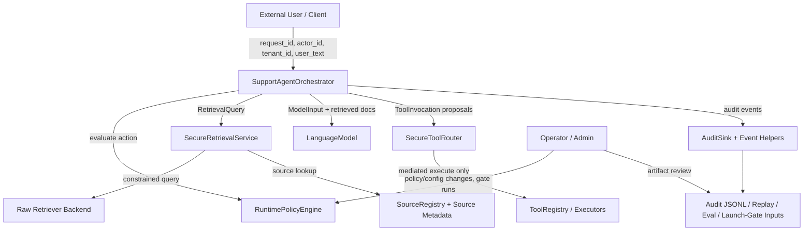

# Trust Boundaries (Implemented Runtime)

This document describes the trust boundaries that exist in the current implementation.
It is aligned to runtime paths in `app/`, `retrieval/`, `tools/`, `policies/`, `telemetry/audit/`, and `launch_gate/`.

## Boundary Topology (Mermaid)

## 1) User Boundary

**Boundary:** external requester -> application request entry (`SupportAgentRequest`).

- **What crosses it:** user text, `request_id`, actor/session/tenant metadata, and channel.
- **What can go wrong:** prompt injection, disclosure attempts, malformed/missing identifiers, tenant spoofing.
- **What controls exist:** request-context normalization in orchestrator flow, policy gates before retrieval/model/tool-routing, blocked-response fail-closed behavior when denied.
- **What should be logged:** `request.start`, stage `policy.decision` events, `deny.event`/`fallback.event`/`error.event` when applicable, and `request.end`.

## 2) Application / Orchestrator Boundary

**Boundary:** orchestrator control plane -> retrieval/model/tool subsystems.

- **What crosses it:** normalized request context, retrieval queries, model input envelopes, tool invocation proposals.
- **What can go wrong:** stage-order regressions, policy bypasses, silent continuation after failure.
- **What controls exist:** explicit policy checks for `retrieval.search`, `model.generate`, and `tools.route`; exception handling returns blocked responses and emits error telemetry.
- **What should be logged:** policy decisions per stage, retrieval/tool decision summaries, deny/fallback/error events, lifecycle start/end.

## 3) Model Boundary

**Boundary:** orchestrator model-input construction -> model output text.

- **What crosses it:** user text, retrieved context, and metadata (`request_id`, actor, tenant, risk tier, trace ID).
- **What can go wrong:** unsafe generation, malicious-instruction following, over-disclosure in outputs.
- **What controls exist:** policy check before generation, retrieval trust/provenance filtering before context assembly, scenario-driven eval coverage for unsafe behaviors.
- **What should be logged:** `policy.decision` for `model.generate`, request lifecycle events, and `error.event` on model-path failure.

## 4) Retrieval Boundary

**Boundary:** orchestrator retrieval request -> secure retrieval service -> raw retrieval backend.

- **What crosses it:** tenant-scoped query text, top-k constraints, source allowlist constraints, candidate documents.
- **What can go wrong:** cross-tenant results, unallowlisted sources, malformed policy constraints, backend exceptions.
- **What controls exist:** deny-by-default input validation, policy-constrained `allowed_source_ids` and `top_k_cap`, fail-closed behavior on policy/backend errors.
- **What should be logged:** `policy.decision` for `retrieval.search`, retrieval summaries (`retrieval.decision`) including document count and effective allowlist.

## 5) Source / Document Boundary

**Boundary:** raw retrieved documents -> accepted documents used by the application.

- **What crosses it:** source registration metadata, trust metadata, provenance metadata, document content.
- **What can go wrong:** unknown/disabled sources, source-tenant mismatch, invalid trust metadata, missing provenance, disallowed trust-domain ingestion.
- **What controls exist:** source-registry lookup, tenant/source matching, trust-domain allowlist checks, trust/provenance validation, optional filter hooks with fail-closed behavior on hook failures.
- **What should be logged:** retrieval decision outcomes and downstream deny/error events when requests become blocked.

## 6) Tool Boundary

**Boundary:** tool invocation proposals -> secure tool router -> tool registry execution.

- **What crosses it:** `tool_name`, `action`, arguments, plus request/actor/tenant context.
- **What can go wrong:** unauthorized tool use, forbidden field submission, execution-path bypass, abuse via repeated requests.
- **What controls exist:** centralized router checks (registration/allowlist/forbidden action/forbidden fields/argument validation/policy decision/confirmation/rate-limit), and registry execution-secret enforcement to block direct execution bypass.
- **What should be logged:** `tool.execution_attempt`, `tool.decision`, `confirmation.required` when needed, and `deny.event` for denied tool paths.

## 7) Policy Boundary

**Boundary:** policy artifact/config -> runtime authorization decisions.

- **What crosses it:** policy bundle JSON, environment context, runtime action+context tuples.
- **What can go wrong:** invalid/missing policy, overly permissive configuration, configuration drift from runtime expectations.
- **What controls exist:** policy loading and validation with restrictive fallback behavior, kill-switch support, action-specific evaluation for retrieval/tool-routing/tool-invocation controls.
- **What should be logged:** `policy.decision` events with action, allow/deny, reason, and risk tier; related deny/fallback events.

## 8) Telemetry / Audit Boundary

**Boundary:** runtime decision points -> audit sinks / persisted evidence.

- **What crosses it:** trace ID, request/actor/tenant identifiers, event type, structured payload metadata.
- **What can go wrong:** missing lifecycle coverage, incomplete investigations, inconsistent traceability.
- **What controls exist:** centralized audit-event creation, explicit event taxonomy, JSONL sink support, replay artifact generation.
- **What should be logged:** end-to-end request lifecycle and major decisions (`request.start`, `policy.decision`, `retrieval.decision`, `tool.decision`, `deny.event`, `fallback.event`, `error.event`, `request.end`).

## 9) Operator / Admin Boundary

**Boundary:** operator/admin actions -> policy/configuration and release-readiness controls.

- **What crosses it:** policy updates, environment-specific settings, launch-gate runs, artifact review decisions.
- **What can go wrong:** misconfiguration, weak allowlists, ignored residual risk, promotion without evidence.
- **What controls exist:** launch-gate checks over policy/audit/eval artifacts, documented evidence-pack workflow, explicit blocker vs residual-risk classification.
- **What should be logged:** launch-gate reports and check evidence, policy artifact provenance, evaluation summaries used for release decisions.

---

See also:
- `docs/architecture.md` for runtime flow and control design.
- `docs/architecture_diagrams.md` for additional implementation-aligned diagrams.
- `docs/threat_model.md` for threat-to-control mapping.
- `docs/security_guarantees.md` for explicit security invariants and evidence/limitations.
